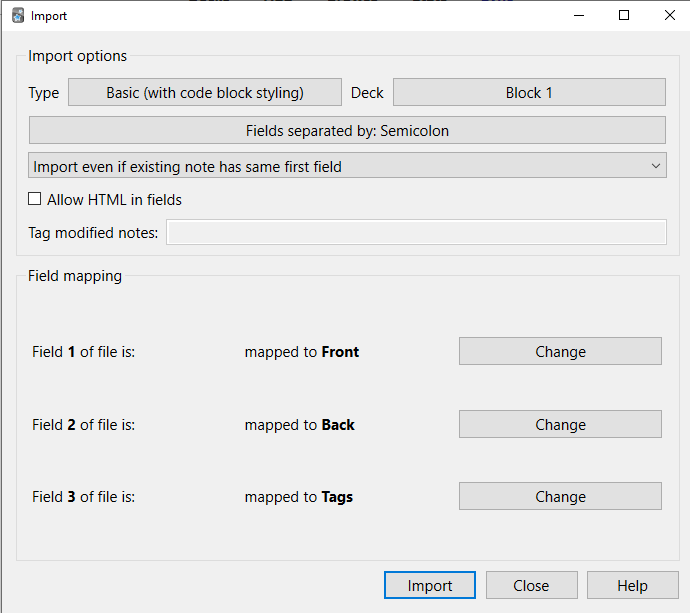

# SAQ-to-Anki
A python script that extracts self assesment questions (SAQs) from Open University textbooks into Anki cards

# Installation

This script uses the `pdftotext` package to convert textbook PDFs into parseable text.

Please note that `pdftotext` has some OS specific dependencies that must be present for a successful installation.

You can find OS specific instructions for installing `pdftotext` here https://github.com/jalan/pdftotext#os-dependencies

In my case (Debian on WSL) installation consisted of:

```
sudo apt install build-essential libpoppler-cpp-dev pkg-config python3-dev
pip install pdftotext
```

# Preparation

You need to have the textbook PDFs downloaded into a directory you know the path to. You can find these textbook PDFs in the TM354 resources section.

Clone this repo, and `cd` into the newly created directory

```
git clone https://github.com/chowieuk/SAQ-to-Anki
cd SAQ-to-Anki
```

You might find it easier if `SAQripper.py` and the textbook PDFs are in the same directory, so I would suggest either moving the script to where you have the textbooks, or vice versa.

# Usage

## Extracting and creating Anki cards

`py SAQripper.py path/to/textbook.pdf`

This will create a file named "textbook cards.txt" containing an Anki card for each SAQ present in the given textbook

So for example if I had a textbook named `Block 1.pdf` in the same directory as the script, I would run:

`py SAQripper.py "Block 1.pdf"`

And I would expect to see a file named `Block 1 cards.txt`
Please take note of the quotes - if your path contains any spaces then you must wrap it in quotes.

## Importing Anki cards

- Open Anki
- Create a new Anki deck e.g. Block 1
- Click Import File
- Choose the relevant text file
- Choose Type "Basic (with code block styling)"
- **Choose the Deck you created earlier**
- My other settings (which I believe are the default) looked like this:



You should receive a notice that looks something like this:

```
Importing complete.
149 notes added, 0 notes updated, 0 notes unchanged.
```

And that's it, you've got your Anki cards!

## Debugging

If you're noticing some issues you can supply the debug flag to get some more information

```
py SAQripper.py path/to/textbook.pdf debug
```

This will create two additional files: `textbook filtered.txt` and `textbook raw.txt` so you can compare the raw output of `pdftotext` with the output from the script after some initial filtering. These two files will help you compose better regexs should you want to improve the results of the script.

Debug mode will also print a significant amount info to the terminal. I found it useful to pipe the debug output to `less` via `py SAQripper.py "Block 1.pdf" | less`

# Known issues

- Sometimes answer blocks are incomplete
    - This results in incompete answers, or missing subanswers

# TODO

- Write and include a test suite
- Add a flag to make tagging cards optional
- Add tags to each card for which Unit the card belongs to
- Remove tags per page number, as they are included in the card body and it creates too many tags
- Add option for cards in two different forms:
    - SAQ + answer block
    - Cards for each subquestions ((a), (b)... etc) (this is the current default mode)
- Add more options for filenames
- Add guards when overwriting files
